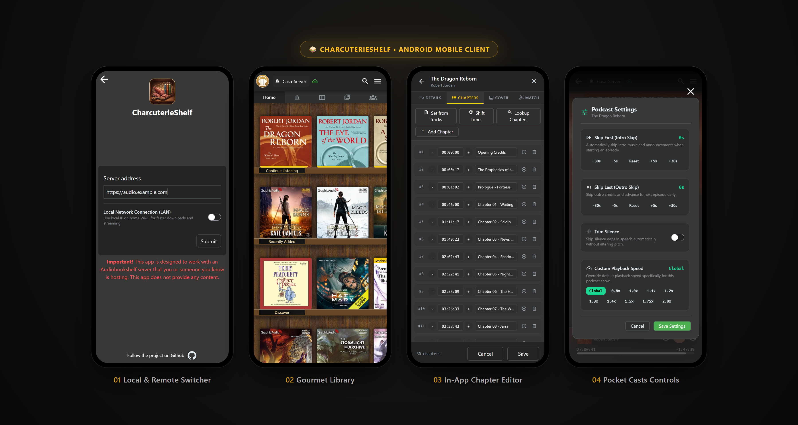
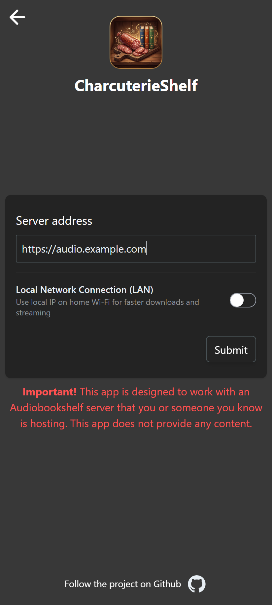
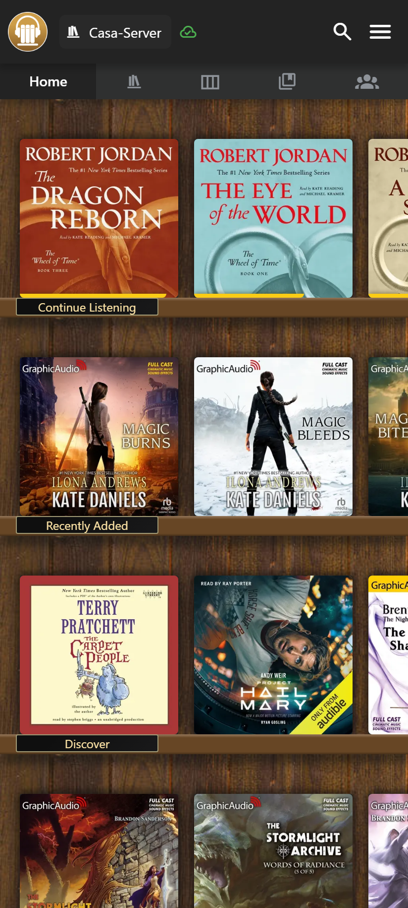
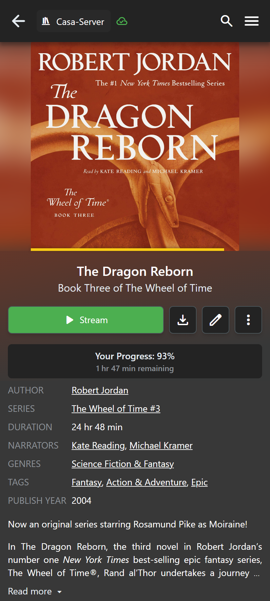
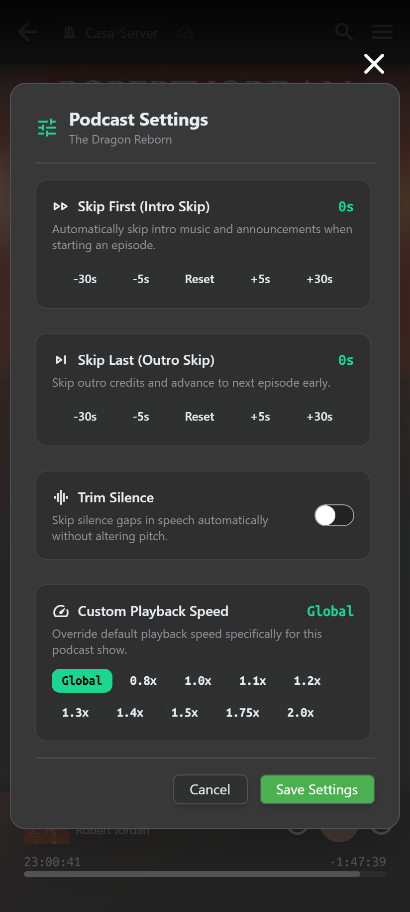
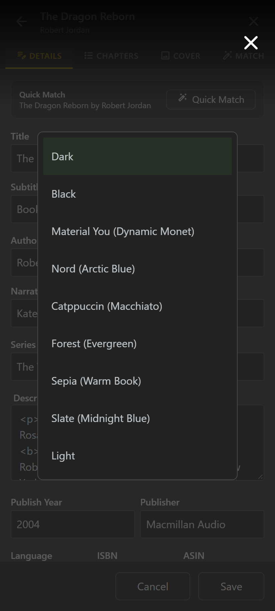
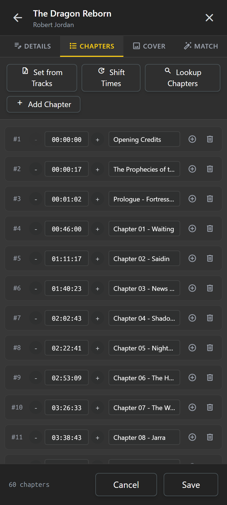
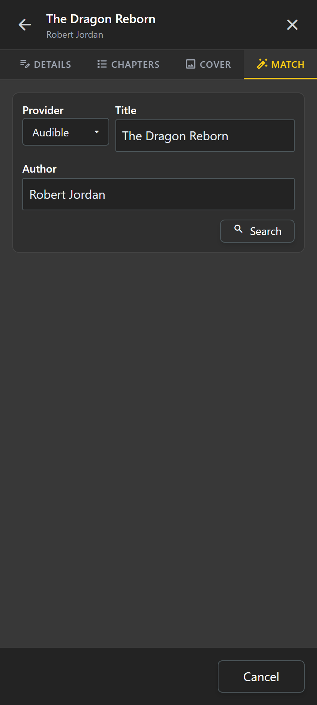
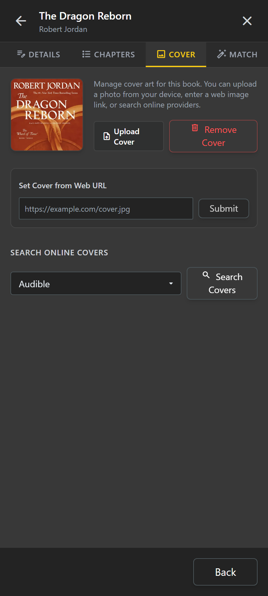

<div align="center">

# CharcuterieShelf 🥪📚

### *A gourmet client for self-hosted audiobooks and podcasts with Material You theming, Pocket Casts playback controls, and smart local/remote switching.*

[](https://buymeacoffee.com/themagicsalami)
[](https://github.com/cavant/CharcuterieShelf/releases/latest/download/CharcuterieShelf.apk)
[](https://www.gnu.org/licenses/gpl-3.0)
[](https://github.com/cavant/CharcuterieShelf)
[](https://github.com/cavant)

<br/>



</div>

---

## 🧪 Help CharcuterieShelf Launch on Google Play! (Call for Testers)

Google Play requires personal developer accounts to run a closed test with at least 14–20 opted-in testers for 14 days before granting production access. You can help get CharcuterieShelf officially published on Google Play!

**How to join the closed test:**
1. Send an email with your Google Play email address to **[support@themagicsalami.net](mailto:support@themagicsalami.net)** with the subject *"CharcuterieShelf Tester"*, or open a **[Closed Testing Request Issue](https://github.com/cavant/CharcuterieShelf/issues/new?template=tester_request.yml)**.
2. Download instant automated test APK builds from the **[Live Web Tester Portal](https://cavant.github.io/CharcuterieShelf/)**.
3. Once added to the tester group, accept the invite on the web:  
   👉 **[Join Closed Testing on the Web](https://play.google.com/apps/testing/com.CharcuterieShelf)**
4. Download the app directly from Google Play:  
   👉 **[CharcuterieShelf on Google Play](https://play.google.com/store/apps/details?id=com.CharcuterieShelf)**
5. Keep the app installed for 14 days and listen to your favorite audiobooks and podcasts! Your active testing directly helps unlock production status.

---

## 📖 About CharcuterieShelf

Welcome to **CharcuterieShelf**! A community-first, feature-packed client for [Audiobookshelf](https://github.com/advplyr/audiobookshelf-app) crafted by **TheMagicSalami** ([cavant](https://github.com/cavant)).

While the official Audiobookshelf app is phenomenal, CharcuterieShelf was created to bridge critical gaps for power listeners: seamlessly moving between high-speed home Wi-Fi and mobile data with a single server profile, integrating top playback features inspired by **Pocket Casts** (including a 3-column reorderable favorites grid and zero-server storage downloads), supporting rich **Material You dynamic Monet wallpaper theming & custom accent palettes**, providing a resilient **Download Manager with error recovery**, a polished **home screen player widget**, and achieving complete **in-app editing parity with the web client**.

---

## ✨ Key Features & Screenshots

### 📥 Resilient Download Manager & Queue Recovery
- **Dedicated Download Manager**: Redesigned `/downloading` view with media card thumbnails, real-time download percentages, downloaded vs total MB counters, and animated indicators.
- **Error Recovery & Exponential Backoff**: Prevents download stalls with smart exponential retry backoff (1s, 2s, 4s, 8s, 16s, capped at 30s; max 5 retries) and dispatches failure notifications if retries are exhausted.
- **Granular Item Controls**: Individual **Retry** and **Cancel / Remove** actions on every active or failed media download.
- **Global Batch Management**: 1-tap **Retry All Failed**, **Clear Failed**, and **Cancel All** batch controls.
- **Collapsible File-by-File Breakdown**: Inspect individual files and parts within a multi-file audiobook with specific progress and error diagnostics.

---

### 🎨 Dynamic Material You & 14 Curated Theme Palettes
- **Dynamic Accent Engine**: Adaptive accent color system extracts Monet wallpaper tones on Android 12+ and applies them seamlessly across the entire app UI, player controls, sliders, chips, and buttons.
- **Material You AMOLED**: Pitch Black `#000000` combined with dynamic Monet wallpaper accents for maximum OLED power efficiency.
- **14 Built-In Themes**:
  - `material-you`: Android 12+ Monet wallpaper extraction.
  - `material-you-amoled`: Pure pitch black with Monet dynamic accents.
  - `dracula`: Iconic vampire dark theme with rich purple & pink accents.
  - `tokyo-night`: Cyberpunk deep navy with electric cyan highlights.
  - `gruvbox`: Retro warm dark with golden yellow accents.
  - `rose-pine`: Muted elegance with soft rose accents.
  - `black`: OLED Pitch Black `#000000`.
  - `nord`: Arctic blue-gray developer palette.
  - `catppuccin`: Macchiato pastel tones on rich plum.
  - `forest`: Deep evergreen pine with mint highlights.
  - `sepia`: Antique book paper and terracotta tones.
  - `slate`: Midnight blue slate with cyan trackbars.
  - `dark`: Balanced neutral charcoal dark.
  - `light`: Crisp daytime white theme.
- **Interactive Custom Accent Color Picker**: Choose custom accents in **Settings** (Theme Default, Emerald, Electric Cyan, Sky Blue, Royal Violet, Hot Pink, Sunset Amber, Crimson Red, Lime) that react instantly across the entire interface.

---

### 📲 In-App Updating via GitHub Releases
- **Automated Update Detection**: CharcuterieShelf checks GitHub Releases for newer versions automatically in the background on startup.
- **One-Tap Download & Install**: Streamlines the APK download with a live progress bar and automatically launches Android's system package installer without requiring manual browser sideloading.
- **On-Demand Checking & Release Notes**: Check for updates anytime from **Settings → App Updates**, read formatted changelogs, or tap the pulsing **Update Available** badge in the navigation drawer.
- **Universal Android Compatibility**: Native support for Android 8 through 16 (API 26–36) with standard `REQUEST_INSTALL_PACKAGES` permission handling and secure `FileProvider` URI isolation.

---

### 🚀 Unified Local & Remote Server Switching
- Configure a single server profile with both your **LAN Address** (`http://192.168.1.x:13378`) and **Remote Address** (`https://audio.example.com`).
- **Local-First Priority**: The app automatically defaults to your local LAN address first with a fast 1500ms reachability test, eliminating connection delays and bypassing Android 10+ Wi-Fi SSID access limitations.
- **Smart VPN & Fallback**: Fast 800ms ping handles private LAN IPs over cellular VPNs. If the local network is unreachable, it smoothly falls back to the remote URL with zero user intervention.
- **Lifecycle Auto-Switch**: Seamlessly re-probes and switches to LAN whenever returning to the app or reconnecting to network.

<div align="center">
  
</div>

---

### 🔀 Dedicated Audiobooks & Podcasts Section Switcher
- **Two-Cell Top-Level Switcher**: Positioned right beneath the top appbar, toggle effortlessly between your Audiobook libraries and Podcast subscriptions.
- **Dedicated Medium Interfaces**: Keeps your books and podcasts completely separate with dedicated navigation bars, toolbars, and layouts tailored to each medium.
- **Smart Server Integration**: Automatically detects audiobook and podcast libraries on your server. If your server doesn't have a podcast library configured yet, an intuitive inline modal lets you create one with custom folder mapping in seconds!

---

### 📥 Pocket Casts OPML Import & Device Storage Integrity
- **Pocket Casts OPML Import**: Directly import your podcast subscription lists exported from Pocket Casts (`.opml`, `.xml`, or text paste).
- **Feed Preview & Filtering**: Live feed parsing, search filtering, and individual or bulk select/deselect checkboxes before importing.
- **Device Storage Integrity**: Automatically prevents server-side audio downloads (`autoDownloadEpisodes: false`). Audio files are strictly stored on the device or direct-streamed, preserving host server storage.
- **Device-First Downloads with Server Sync**: Downloaded podcast episodes remain safely on your physical device for reliable offline listening, while episode metadata, show notes, and listening progress seamlessly sync with your server.

---

### 📚 Gourmet Library & Details Experience
- Full high-fidelity bookshelf layout with realistic wood shelving and cover art caching.
- Direct-to-stream and offline download management.
- Real-time progress tracking with hours/minutes remaining.

<div align="center">
  
  
</div>

---

### 🎙️ Pocket Casts-Inspired Podcatcher Power
- **Per-User Podcast Siloing**: Each user maintains their own private podcast subscription list per server. When you log in, only your subscribed shows appear on your bookshelf and feeds—keeping podcast libraries fully personalized across different users sharing a single server.
- **Device-Only Downloads & Direct Streaming**: Audio files download strictly to your phone or stream directly from podcast feed enclosures. The server's hard drive is never filled with media files, while playback progress and finished states sync to the server.
- **1-Tap Pocket Casts Subscribe Toggle**: Subscribe or unsubscribe directly from any podcast detail screen with a single tap, matching Pocket Casts' iconic badge styling.
- **Full RSS Feed Inline Browsing**: Automatically loads the entire podcast RSS catalog inline without opening separate modals. Tap any episode row to instantly view show notes and full description.
- **Downloaded-First Smart Floating Sort**: Downloaded episodes automatically float to the top of the episode list with a visual section divider, followed by all remaining episodes.
- **Flexible Pocket Casts Episode Sorting**: Sort episodes Newest to Oldest, Oldest to Newest, Shortest to Longest (Duration), Longest to Shortest, Title A→Z, Title Z→A, Season, and Episode Number.
- **Podcast Favorites & Custom Reorder Grid**: Dedicated **Favorites** tab under the Podcasts section featuring a 3-column Pocket Casts-style cover art grid. Shows display circular unplayed episode count badges in the top-right corner, and can be freely reordered by drag-and-drop into any custom arrangement with instant persistence per user.
- **1-Tap Favorite Toggle**: Star or unstar any podcast show directly from its item details screen or item more menu, with instant sync across all views.
- **Dedicated Reorder Mode & Batch Picker**: Toggle Reorder mode to easily drag icons or tap quick-remove badges, filter shows with instant search, or open the batch Add Favorites modal to multi-select shows from your library.
- **1-Tap Seeding from Subscriptions**: When starting with an empty favorites shelf, 1-tap "Add Subscribed Shows" automatically populates your favorites grid so you can immediately arrange your top podcasts.
- **Trim Silence**: Real-time silence skipping powered by ExoPlayer's native audio pipeline—no gaps, no pitch changes.
- **Intro & Outro Skipping**: Set custom skip durations per podcast show (e.g. skip first 45s of intro ads, skip last 30s of credits).
- **Per-Show Playback Speeds**: Automatically remembers your preferred listening speed for each podcast independently.
- **End of Episode Sleep Timer**: Automatic sleep timer calculated precisely to the end of the current podcast episode.
- **Filter Chips & Instant Search**: Quickly filter episode lists by *All*, *Unplayed*, *In Progress*, *Complete*, and *Downloaded*, or search episode titles and show notes in real time.

<div align="center">
  
</div>

---

### 🎨 Material You & 14 Curated Themes
- **Material You (Dynamic Monet)**: Extracts color accents from your Android 12+ system wallpaper and applies them across the entire app UI and player controls.
- **OLED Pitch Black**: Pure `#000000` dark mode optimized for battery saving on AMOLED displays.
- **Nord**: Cool, arctic blue-gray aesthetic inspired by the popular developer palette.
- **Catppuccin Macchiato**: Soothing pastel accents on a rich dark plum foundation.
- **Forest Evergreen**: Deep pine green backdrop with soft mint accents.
- **Sepia Paper**: Warm amber and leather tones reminiscent of reading an antique physical book.
- **Midnight Slate**: Crisp modern dark slate with cyan accents.
- **Default Dark & Light**: Balanced neutral charcoal and clean daytime themes.

<div align="center">
  
</div>

---

### ✏️ Full In-App Web Client Parity
No need to open the desktop browser just to fix a typo or chapter mark:
- **Interactive Chapter Editor**: Batch-adjust chapters, shift start times, fine-tune timestamps with `+/- 1s` buttons, set from individual audio tracks, or fetch official Audible chapters by ASIN.
- **Provider Match**: Search Google Books, Audible, and OpenLibrary with granular field-by-field merge controls.
- **Cover Art Manager**: Upload new images from your device gallery/camera, paste an image URL, or search OpenLibrary/Audible for high-res cover art.

<div align="center">
  
  
  
</div>

---

### 📱 Modern Material 3 Playback Widget
- Home screen widget styled with Material 3 card curvature and elevated container styling.
- Smooth rounded-corner album art previews powered by Glide transformations.
- Instant responsive controls: Rewind 10s, Play/Pause, and Fast-Forward 10s directly from your Android launcher.

---

## 🔒 Privacy Policy (Zero-Data Collection)

CharcuterieShelf was designed from the ground up for total user privacy and autonomy:

1. **Zero Data Collection**: We do not collect, log, track, or transmit any personal data, usage analytics, or device identifiers.
2. **Direct Connection**: All communication takes place strictly between your device and your private, self-hosted Audiobookshelf server. There are no intermediary proxies or analytics servers.
3. **Local Storage**: Authentication tokens, media progress, and offline downloads remain encrypted and stored solely on your physical device.
4. **Zero Trackers**: Contains zero advertising SDKs, zero behavioral trackers, and zero telemetry frameworks.

---

## ☕ Support Ongoing Development

CharcuterieShelf is 100% free and open source with zero paywalls. If you enjoy using the app and want to support ongoing maintenance and new features, consider buying a coffee!

<div align="center">

[](https://buymeacoffee.com/themagicsalami)

**[https://buymeacoffee.com/themagicsalami](https://buymeacoffee.com/themagicsalami)**

</div>

---

## 🛠️ Building From Source

### Prerequisites
- [Node.js](https://nodejs.org/) (v20 LTS recommended)
- [Git](https://git-scm.com/)
- [Java JDK 21](https://adoptium.net/)
- [Android Studio & SDK](https://developer.android.com/studio) (API 36+)

### 1. Clone the Repository
```bash
git clone https://github.com/cavant/CharcuterieShelf.git
cd CharcuterieShelf
```

### 2. Install Dependencies
```bash
npm install
```

### 3. Compile the Web Assets & Sync Capacitor
```bash
npm run generate
npx cap sync
```

### 4. Build Android APKs
```powershell
# Windows PowerShell
$env:JAVA_HOME = "C:\Java\jdk-21"
cd android

# Build Debug APK
.\gradlew.bat assembleDebug
# Output: android/app/build/outputs/apk/debug/app-debug.apk

# Build Signed Release APK (applicationId: com.CharcuterieShelf, targetSdkVersion: 36)
.\gradlew.bat assembleRelease
# Output: android/app/build/outputs/apk/release/app-release.apk

# Build Signed Release Android App Bundle (AAB for Google Play Store)
.\gradlew.bat bundleRelease
# Output: android/app/build/outputs/bundle/release/app-release.aab
```

### 5. Automated Google Play Publishing
```powershell
# Publish to Closed Testing (alpha track)
.\publish_play_console.ps1 -Track alpha

# Publish to Production (once unlocked)
.\publish_play_console.ps1 -Track production
```

### 6. Automated Full-Stack QA & Code Review Harness
Ensure your changes are release-ready across all layers:
```powershell
# Run the entire full-stack QA suite (all 10 verification suites)
npm run test:qa

# Run full end-to-end compilation + verification (Nuxt bundle + Android native sources)
npm run test:full

# Or run specific test targets:
npm test                  # Frontend unit tests (semver, duration, favorites, theming, queue)
npm run test:i18n         # i18n syntax & ASCII sort check
npm run test:branding     # Package ID, custom URL scheme, and native manifests
npm run test:github       # CI/CD workflows and issue templates
npm run test:build        # Static Nuxt bundle pre-rendering health
npm run test:android      # Gradle wrapper, Java 21, and Android SDK prerequisites
npm run test:android:compile # Execute native Android gradle compilation
```
Reusable Antigravity QA Skill: `.agents/skills/charcuterieshelf-qa-review/SKILL.md`

---

## 📜 Credits & Attribution

CharcuterieShelf stands on the shoulders of giants. We express sincere gratitude to the upstream authors and open source communities:

- **[Audiobookshelf](https://github.com/advplyr/audiobookshelf)** & **[audiobookshelf-app](https://github.com/advplyr/audiobookshelf-app)**  
  Created by **advplyr** and contributors under the GNU General Public License v3.0.
- **[Pocket Casts Android](https://github.com/Automattic/pocket-casts-android)**  
  Maintained by **Automattic** under the GNU General Public License v3.0, which inspired our podcatcher playback and queue enhancements.
- **[TheMagicSportslami](https://github.com/cavant)**  
  Reference companion project by TheMagicSalami for legal disclaimers, support framework, and zero-data privacy architecture.
- **[Nuxt.js](https://nuxtjs.org/)** & **[Vue.js](https://vuejs.org/)** (MIT License)
- **[Capacitor](https://capacitorjs.com/)** by Ionic (MIT License)
- **[ExoPlayer / Media3](https://github.com/androidx/media)** by Google LLC (Apache 2.0)

---

## ⚖️ License

This project is licensed under the **GNU General Public License v3.0** (GPL-3.0). See [LICENSE](LICENSE) for details.
